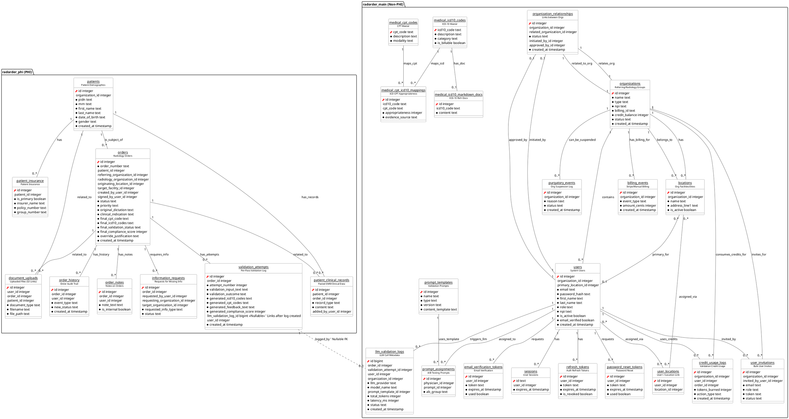

```plantuml
@startuml RadOrderPad ERD (Reconciled v1.1)

!define Table(name,desc) class name as "<u>name</u>\n<size:10>desc</size>"
!define PK(field) <color:red><&key></color> field
!define FK(field) <color:blue><&link></color> field
!define LogicalFK(field) <color:green><&link-out></color> field
!define Column(field) <color:black><&media-record></color> field

skinparam class {
  BackgroundColor White
  ArrowColor #505050
  BorderColor #505050
  FontName Technical
}
hide stereotypes
hide circle

package "radorder_main (Non-PHI)" {

  Table(organizations, "Referring/Radiology Groups") {
    PK(id) integer
    Column(name) text
    Column(type) text
    Column(npi) text
    Column(billing_id) text
    Column(credit_balance) integer
    Column(status) text
    Column(created_at) timestamp
  }

  Table(locations, "Org Facilities/Sites") {
    PK(id) integer
    FK(organization_id) integer
    Column(name) text
    Column(address_line1) text
    Column(is_active) boolean
  }

  Table(users, "System Users") {
    PK(id) integer
    FK(organization_id) integer
    FK(primary_location_id) integer
    Column(email) text
    Column(password_hash) text
    Column(first_name) text
    Column(last_name) text
    Column(role) text
    Column(npi) text
    Column(is_active) boolean
    Column(email_verified) boolean
    Column(created_at) timestamp
  }

  Table(user_locations, "User<->Location Link") {
     PK(id) integer
     FK(user_id) integer
     FK(location_id) integer
  }

  Table(organization_relationships, "Links between Orgs") {
    PK(id) integer
    FK(organization_id) integer
    FK(related_organization_id) integer
    Column(status) text
    FK(initiated_by_id) integer
    FK(approved_by_id) integer
    Column(created_at) timestamp
  }

  Table(sessions, "User Sessions") {
    PK(id) text
    FK(user_id) integer
    Column(expires_at) timestamp
  }

  Table(refresh_tokens, "Auth Refresh Tokens") {
    PK(id) integer
    FK(user_id) integer
    Column(token) text
    Column(expires_at) timestamp
    Column(is_revoked) boolean
  }

  Table(password_reset_tokens, "Password Reset") {
     PK(id) integer
     FK(user_id) integer
     Column(token) text
     Column(expires_at) timestamp
     Column(used) boolean
  }

  Table(email_verification_tokens, "Email Verification") {
     PK(id) integer
     FK(user_id) integer
     Column(token) text
     Column(expires_at) timestamp
     Column(used) boolean
  }

  Table(user_invitations, "Bulk User Invites") {
    PK(id) integer
    FK(organization_id) integer
    FK(invited_by_user_id) integer
    Column(email) text
    Column(role) text
    Column(token) text
    Column(status) text
  }

  Table(medical_icd10_codes, "ICD-10 Master") {
    PK(icd10_code) text
    Column(description) text
    Column(category) text
    Column(is_billable) boolean
  }

  Table(medical_cpt_codes, "CPT Master") {
    PK(cpt_code) text
    Column(description) text
    Column(modality) text
  }

  Table(medical_cpt_icd10_mappings, "ICD-CPT Appropriateness") {
    PK(id) integer
    FK(icd10_code) text
    FK(cpt_code) text
    Column(appropriateness) integer
    Column(evidence_source) text
  }

  Table(medical_icd10_markdown_docs, "ICD-10 Rich Docs") {
    PK(id) integer
    FK(icd10_code) text
    Column(content) text
  }

  Table(billing_events, "Stripe/Manual Billing") {
    PK(id) integer
    FK(organization_id) integer
    Column(event_type) text
    Column(amount_cents) integer
    Column(created_at) timestamp
  }

  Table(credit_usage_logs, "Validation Credit Usage") {
    PK(id) integer
    FK(organization_id) integer
    FK(user_id) integer
    LogicalFK(order_id) integer
    Column(tokens_burned) integer
    Column(action_type) text
    Column(created_at) timestamp
  }

  Table(purgatory_events, "Org Suspension Log") {
    PK(id) integer
    FK(organization_id) integer
    Column(reason) text
    Column(status) text
    Column(created_at) timestamp
  }

  Table(llm_validation_logs, "LLM Call Metadata") {
    PK(id) bigint
    LogicalFK(order_id) integer
    LogicalFK(validation_attempt_id) integer
    FK(user_id) integer
    FK(organization_id) integer
    Column(llm_provider) text
    Column(model_name) text
    FK(prompt_template_id) integer
    Column(total_tokens) integer
    Column(latency_ms) integer
    Column(status) text
    Column(created_at) timestamp
  }

  Table(prompt_templates, "Validation Prompts") {
    PK(id) integer
    Column(name) text
    Column(type) text
    Column(version) text
    Column(content_template) text
  }

  Table(prompt_assignments, "A/B Testing Prompts") {
    PK(id) integer
    FK(physician_id) integer
    FK(prompt_id) integer
    Column(ab_group) text
  }

}

package "radorder_phi (PHI)" {

  Table(patients, "Patient Demographics") {
    PK(id) integer
    LogicalFK(organization_id) integer
    Column(pidn) text
    Column(mrn) text
    Column(first_name) text
    Column(last_name) text
    Column(date_of_birth) text
    Column(gender) text
    Column(created_at) timestamp
  }

  Table(patient_insurance, "Patient Insurance") {
    PK(id) integer
    FK(patient_id) integer
    Column(is_primary) boolean
    Column(insurer_name) text
    Column(policy_number) text
    Column(group_number) text
  }

  Table(orders, "Radiology Orders") {
    PK(id) integer
    Column(order_number) text
    FK(patient_id) integer
    LogicalFK(referring_organization_id) integer
    LogicalFK(radiology_organization_id) integer
    LogicalFK(originating_location_id) integer
    LogicalFK(target_facility_id) integer
    LogicalFK(created_by_user_id) integer
    LogicalFK(signed_by_user_id) integer
    Column(status) text
    Column(priority) text
    Column(original_dictation) text
    Column(clinical_indication) text
    Column(final_cpt_code) text
    Column(final_icd10_codes) text
    Column(final_validation_status) text
    Column(final_compliance_score) integer
    Column(override_justification) text
    Column(created_at) timestamp
  }

  Table(order_history, "Order Audit Trail") {
    PK(id) integer
    FK(order_id) integer
    LogicalFK(user_id) integer
    Column(event_type) text
    Column(new_status) text
    Column(created_at) timestamp
  }

  Table(order_notes, "Notes on Orders") {
    PK(id) integer
    FK(order_id) integer
    LogicalFK(user_id) integer
    Column(note_text) text
    Column(is_internal) boolean
  }

  Table(document_uploads, "Uploaded Files (S3 Links)") {
    PK(id) integer
    LogicalFK(user_id) integer
    FK(order_id) integer
    FK(patient_id) integer
    Column(document_type) text
    Column(filename) text
    Column(file_path) text
  }

  Table(patient_clinical_records, "Pasted EMR/Clinical Data") {
    PK(id) integer
    FK(patient_id) integer
    FK(order_id) integer
    Column(record_type) text
    Column(content) text
    LogicalFK(added_by_user_id) integer
  }

  Table(information_requests, "Requests for Missing Info") {
    PK(id) integer
    FK(order_id) integer
    LogicalFK(requested_by_user_id) integer
    LogicalFK(requesting_organization_id) integer
    LogicalFK(target_organization_id) integer
    Column(requested_info_type) text
    Column(status) text
  }

  Table(validation_attempts, "Per-Pass Validation Log") {
    PK(id) integer
    FK(order_id) integer
    Column(attempt_number) integer
    Column(validation_input_text) text
    Column(validation_outcome) text
    Column(generated_icd10_codes) text
    Column(generated_cpt_codes) text
    Column(generated_feedback_text) text
    Column(generated_compliance_score) integer
    LogicalFK(llm_validation_log_id) bigint <<Nullable>> ' Links after log created
    LogicalFK(user_id) integer
    Column(created_at) timestamp
  }

}

' --- Relationships ---
organizations "1" -- "0..*" users : contains
organizations "1" -- "0..*" locations : has
organizations "1" -- "0..*" user_invitations : invites_for
organizations "1" -- "0..*" billing_events : has_billing_for
organizations "1" -- "0..*" credit_usage_logs : consumes_credits_for
organizations "1" -- "0..*" purgatory_events : can_be_suspended

locations "0..*" -- "1" organizations : belongs_to
locations "0..*" -- "0..*" user_locations : assigned_via
locations "0..*" -- "0..1" users : primary_for

users "1" -- "0..*" sessions : has
users "1" -- "0..*" refresh_tokens : has
users "1" -- "0..*" password_reset_tokens : requests
users "1" -- "0..*" email_verification_tokens : requests
users "1" -- "0..*" user_invitations : invited_by
users "1" -- "0..*" prompt_assignments : assigned_to
users "1" -- "0..*" credit_usage_logs : uses_credits
users "1" -- "0..*" llm_validation_logs : triggers_llm
users "0..*" -- "0..*" user_locations : assigned_via

organization_relationships "1" -- "1" organizations : relates_org
organization_relationships "1" -- "1" organizations : related_to_org
organization_relationships "0..1" -- "1" users : initiated_by
organization_relationships "0..1" -- "1" users : approved_by

medical_icd10_codes "1" -- "0..*" medical_cpt_icd10_mappings : maps_icd
medical_cpt_codes "1" -- "0..*" medical_cpt_icd10_mappings : maps_cpt
medical_icd10_codes "1" -- "0..1" medical_icd10_markdown_docs : has_doc

prompt_templates "1" -- "0..*" prompt_assignments : uses_template

patients "1" -- "0..*" patient_insurance : has
patients "1" -- "0..*" orders : is_subject_of
patients "1" -- "0..*" document_uploads : related_to
patients "1" -- "0..*" patient_clinical_records : has_records

orders "1" -- "0..*" order_history : has_history
orders "1" -- "0..*" order_notes : has_notes
orders "1" -- "0..*" document_uploads : related_to
orders "1" -- "0..*" patient_clinical_records : related_to
orders "1" -- "0..*" information_requests : requires_info
orders "1" -- "0..*" validation_attempts : has_attempts

validation_attempts "1" .. "0..1" llm_validation_logs : logged_by ' Nullable FK

@enduml
```