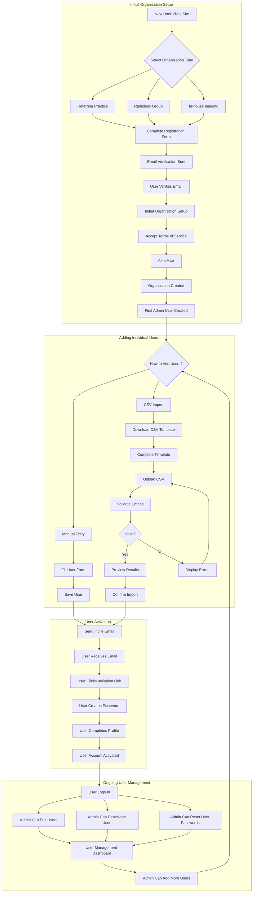

# User Onboarding Process

This document outlines the streamlined user onboarding process for both referring physician practices and radiology groups in the RadOrderPad system.

## Table of Contents
1. [Complete Onboarding Flow Diagram](#complete-onboarding-flow-diagram)
2. [Referring Physician Groups](#referring-physician-groups)
   - [Import Process](#physicians-import-process)
   - [CSV Format](#physicians-csv-format)
   - [Validation Requirements](#physicians-validation-requirements)
   - [User Interface](#physicians-user-interface)

3. [Radiology Groups](#radiology-groups)
   - [Import Process](#radiologists-import-process)
   - [CSV Format](#radiologists-csv-format)
   - [Validation Requirements](#radiologists-validation-requirements)
   - [User Interface](#radiologists-user-interface)

4. [Implementation Details](#implementation-details)
   - [Database Requirements](#database-requirements)
   - [Email Templates](#email-templates)
   - [Backend Processing](#backend-processing)

## Complete Onboarding Flow Diagram



This diagram illustrates the complete onboarding flow from initial organization registration through user management.

## Referring Physician Groups

### Physicians Import Process

1. Admin logs into their organization dashboard
2. Clicks "Manage Users" and then "Import Users"
3. Sees an example CSV format and instructions
4. Drags and drops their user CSV file
5. Reviews the validation results immediately displayed on screen
6. Confirms the import
7. System creates accounts and sends invitation emails

### Physicians CSV Format

```csv
first_name,last_name,email,npi,specialty,role
John,Smith,jsmith@groupname.com,1234567890,Cardiology,physician
Sarah,Johnson,sjohnson@groupname.com,0987654321,Neurology,physician
Michael,Williams,mwilliams@groupname.com,5678901234,Internal Medicine,admin
```

### Physicians Validation Requirements

For referring physician groups, we require:

1. **Required Fields**
   - First name
   - Last name
   - Email address
   - NPI number (for physicians only)

2. **NPI Validation**
   - Format check (10 digits)
   - Optional external validation (can be added later)

3. **Email Verification**
   - Valid email format
   - User must click link in invitation email
   - No duplicate emails allowed

### Physicians User Interface

#### Import Screen

```
┌──────────────────────────────────────────────────────────────┐
│ Import Users                                                 │
├──────────────────────────────────────────────────────────────┤
│ Example Format:                                              │
│ ┌────────────┬────────────┬─────────────────┬────────────┐   │
│ │ first_name │ last_name  │ email           │ npi        │   │
│ ├────────────┼────────────┼─────────────────┼────────────┤   │
│ │ John       │ Smith      │ jsmith@group.com│ 1234567890 │   │
│ └────────────┴────────────┴─────────────────┴────────────┘   │
│                                                              │
│ [Download Template]                                          │
│                                                              │
│ ┌────────────────────────────────────────────────────────┐   │
│ │                                                        │   │
│ │                                                        │   │
│ │ Drag & drop a CSV file here, or click to select a file │   │
│ │                                                        │   │
│ │                                                        │   │
│ └────────────────────────────────────────────────────────┘   │
└──────────────────────────────────────────────────────────────┘
```

#### Preview/Validation Screen

```
┌──────────────────────────────────────────────────────────────┐
│ Preview Import Results (4 valid records, 1 invalid record)   │
├──────────────────────────────────────────────────────────────┤
│ ┌─────┬────────────┬────────────┬─────────────────┬──────────┐│
│ │     │ First Name │ Last Name  │ Email           │ NPI      ││
│ ├─────┼────────────┼────────────┼─────────────────┼──────────┤│
│ │ ✓   │ John       │ Smith      │ jsmith@group.com│1234567890││
│ ├─────┼────────────┼────────────┼─────────────────┼──────────┤│
│ │ ✓   │ Sarah      │ Johnson    │ sjohn@group.com │0987654321││
│ ├─────┼────────────┼────────────┼─────────────────┼──────────┤│
│ │ ✓   │ Michael    │ Williams   │ mw@group.com    │5678901234││
│ ├─────┼────────────┼────────────┼─────────────────┼──────────┤│
│ │ ✓   │ Lisa       │ Brown      │ lbrown@group.com│2345678901││
│ ├─────┼────────────┼────────────┼─────────────────┼──────────┤│
│ │ ❌  │ David      │ Miller     │ invalid-email   │3456789012││
│ │     │            │            │ ← Invalid email format      ││
│ └─────┴────────────┴────────────┴─────────────────┴──────────┘│
│                                                                │
│                         [Cancel] [Import Users]                │
└────────────────────────────────────────────────────────────────┘
```

## Radiology Groups

### Radiologists Import Process

1. Admin logs into their organization dashboard
2. Clicks "Manage Users" and then "Import Users"
3. Sees an example CSV format and instructions
4. Drags and drops their user CSV file
5. Reviews the validation results immediately displayed on screen
6. Confirms the import
7. System creates accounts and sends invitation emails

### Radiologists CSV Format

```csv
first_name,last_name,email,role
Robert,Jones,rjones@radiology.com,radiologist
Jennifer,Davis,jdavis@radiology.com,technologist
Thomas,Wilson,twilson@radiology.com,admin
```

### Radiologists Validation Requirements

For radiology groups, we require minimal validation:

1. **Required Fields**
   - First name
   - Last name
   - Email address

2. **Email Verification**
   - Valid email format
   - User must click link in invitation email
   - No duplicate emails allowed

3. **Role Assignment**
   - Default role is "radiologist" if not specified
   - Other roles: admin, technologist, receptionist

### Radiologists User Interface

The user interface is identical to the physician import process, but with a simpler CSV format example shown.

## Implementation Details

### Database Requirements

```sql
-- Add to users table if not already present
ALTER TABLE users ADD COLUMN IF NOT EXISTS npi VARCHAR(10);
ALTER TABLE users ADD COLUMN IF NOT EXISTS specialty VARCHAR(100);
ALTER TABLE users ADD COLUMN IF NOT EXISTS invite_token VARCHAR(40);
ALTER TABLE users ADD COLUMN IF NOT EXISTS invite_expires_at TIMESTAMP;
ALTER TABLE users ADD COLUMN IF NOT EXISTS email_verified BOOLEAN DEFAULT FALSE;

-- Audit logs for imports
CREATE TABLE IF NOT EXISTS audit_logs (
  id UUID PRIMARY KEY,
  user_id UUID REFERENCES users(id),
  action VARCHAR(50) NOT NULL, -- 'import_users', 'user_verification', etc.
  resource_type VARCHAR(20), -- 'users', etc.
  details JSONB, -- Additional context about the action
  ip_address VARCHAR(45),
  created_at TIMESTAMP DEFAULT CURRENT_TIMESTAMP
);
```

### Email Templates

#### Invitation Email

**Subject:** You've been invited to join RadOrderPad by {{organizationName}}

```
Hi {{firstName}},

You've been invited to join RadOrderPad by {{organizationName}}.

RadOrderPad helps streamline the radiology ordering process, making it faster and more accurate.

To get started:

1. Click this link to set up your account: {{invitationLink}}
2. Create your password
3. Log in and start using RadOrderPad

This invitation expires in 7 days.

If you believe this invitation was sent in error, please ignore this email.

Best regards,
The RadOrderPad Team
```

### Backend Processing

```javascript
// Simple function to process imported CSV users
async function processUserImport(csvData, organizationId, adminUserId) {
  const records = Papa.parse(csvData, { header: true }).data;
  const results = {
    total: records.length,
    successful: 0,
    failed: 0,
    errors: []
  };
  
  for (const record of records) {
    try {
      // Basic validation
      if (!record.first_name || !record.last_name || !record.email) {
        results.failed++;
        results.errors.push({
          row: records.indexOf(record) + 1,
          error: 'Missing required fields',
          record
        });
        continue;
      }
      
      // Email format validation
      if (!/^[^\s@]+@[^\s@]+\.[^\s@]+$/.test(record.email)) {
        results.failed++;
        results.errors.push({
          row: records.indexOf(record) + 1,
          error: 'Invalid email format',
          record
        });
        continue;
      }
      
      // Check for duplicates
      const existingUser = await db.query(
        "SELECT id FROM users WHERE email = $1", 
        [record.email]
      );
      
      if (existingUser.rowCount > 0) {
        results.failed++;
        results.errors.push({
          row: records.indexOf(record) + 1,
          error: 'Email already exists in system',
          record
        });
        continue;
      }
      
      // Create the user
      const userId = uuidv4();
      const inviteToken = crypto.randomBytes(20).toString('hex');
      const currentOrg = await db.query(
        "SELECT name FROM organizations WHERE id = $1",
        [organizationId]
      );
      const organizationName = currentOrg.rows[0].name;
      
      await db.query(`
        INSERT INTO users (
          id, email, first_name, last_name, 
          organization_id, role, npi, specialty,
          invite_token, invite_expires_at
        ) VALUES ($1, $2, $3, $4, $5, $6, $7, $8, $9, $10)
      `, [
        userId,
        record.email,
        record.first_name,
        record.last_name,
        organizationId,
        record.role || (record.npi ? 'physician' : 'radiologist'), // Default based on context
        record.npi || null,
        record.specialty || null,
        inviteToken,
        new Date(Date.now() + 7 * 24 * 60 * 60 * 1000) // 7 days expiration
      ]);
      
      // Send invitation email
      await sendEmail({
        to: record.email,
        subject: `You've been invited to join RadOrderPad by ${organizationName}`,
        template: 'invitation',
        data: {
          firstName: record.first_name,
          organizationName,
          invitationLink: `${process.env.APP_URL}/accept-invitation?token=${inviteToken}`
        }
      });
      
      results.successful++;
    } catch (error) {
      console.error('Error creating user:', error);
      results.failed++;
      results.errors.push({
        row: records.indexOf(record) + 1,
        error: 'Server error creating user',
        record
      });
    }
  }
  
  // Log the import activity
  await db.query(`
    INSERT INTO audit_logs (
      id, user_id, action, resource_type, details, ip_address
    ) VALUES ($1, $2, $3, $4, $5, $6)
  `, [
    uuidv4(),
    adminUserId,
    'import_users',
    'users',
    JSON.stringify({
      organization_id: organizationId,
      total: results.total,
      successful: results.successful,
      failed: results.failed
    }),
    'system'
  ]);
  
  return results;
}
```

## Frontend Implementation

Using React with a simple drag-and-drop component:

```jsx
function ImportUsers() {
  const [file, setFile] = useState(null);
  const [preview, setPreview] = useState(null);
  const [isProcessing, setIsProcessing] = useState(false);
  const [isComplete, setIsComplete] = useState(false);
  const [result, setResult] = useState(null);
  const { organization } = useOrganization(); // Custom hook to get org context
  
  const handleDrop = (acceptedFiles) => {
    setFile(acceptedFiles[0]);
    parseAndPreviewCsv(acceptedFiles[0]);
  };
  
  const parseAndPreviewCsv = (file) => {
    const reader = new FileReader();
    reader.onload = async (e) => {
      // Parse the CSV and validate basic format
      const records = Papa.parse(e.target.result, { header: true }).data;
      
      // Perform basic validation
      const validatedRecords = records.map(record => ({
        ...record,
        isValid: Boolean(record.first_name && record.last_name && record.email && 
                  /^[^\s@]+@[^\s@]+\.[^\s@]+$/.test(record.email)),
        errors: []
      }));
      
      // Check for required fields
      validatedRecords.forEach(record => {
        if (!record.first_name) record.errors.push('Missing first name');
        if (!record.last_name) record.errors.push('Missing last name');
        if (!record.email) record.errors.push('Missing email');
        else if (!/^[^\s@]+@[^\s@]+\.[^\s@]+$/.test(record.email)) {
          record.errors.push('Invalid email format');
        }
        
        // For physician organizations, check NPI if role is physician
        if (organization.type === 'referring_practice' && 
            (!record.role || record.role === 'physician') && 
            (!record.npi || !/^\d{10}$/.test(record.npi))) {
          record.errors.push('Missing or invalid NPI (must be 10 digits)');
        }
      });
      
      setPreview(validatedRecords);
    };
    reader.readAsText(file);
  };
  
  const handleImport = async () => {
    if (!file || !preview) return;
    
    setIsProcessing(true);
    
    try {
      const formData = new FormData();
      formData.append('file', file);
      
      const response = await fetch('/api/users/import', {
        method: 'POST',
        body: formData
      });
      
      const data = await response.json();
      
      if (data.success) {
        setResult(data);
        setIsComplete(true);
      } else {
        // Show error
        console.error('Import failed:', data.message);
      }
    } catch (error) {
      console.error('Import error:', error);
    } finally {
      setIsProcessing(false);
    }
  };
  
  // Render UI as shown in the mockups above
  // ...
}
```

## Conclusion

This approach provides:

1. **Identical Experience** for both user types with only minor differences
2. **Minimal Friction** with just basic validation
3. **Email Verification** as the primary security mechanism
4. **Low Technical Barrier** for non-technical admins
5. **Quick Onboarding** for entire teams in minutes

The asymmetry in validation makes sense because:
- Ordering physicians are entering critical medical information
- Radiologists are primarily receiving and responding to orders
- The risk profile is different on each side

This approach prioritizes simplifying the onboarding process while still ensuring basic data integrity.